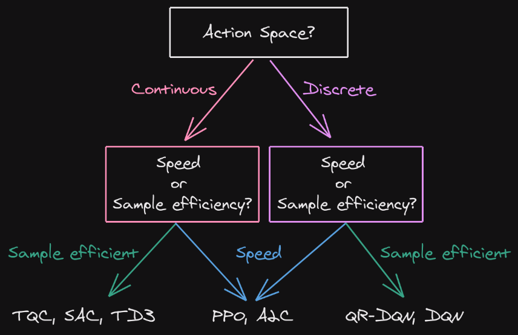
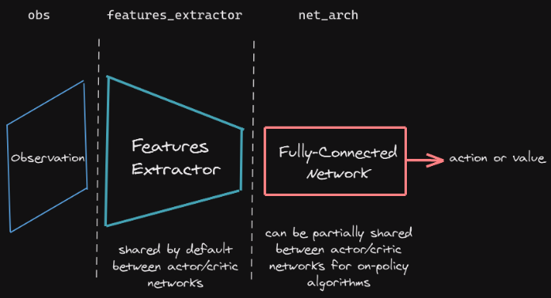
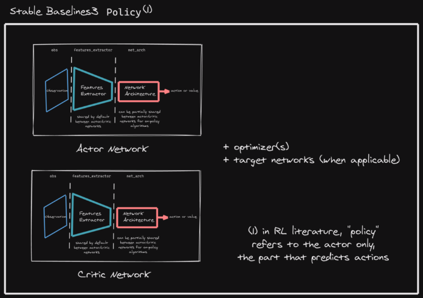
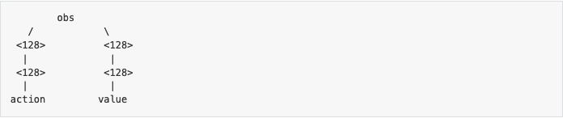
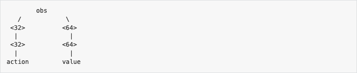

# Learning Stable-Baselines3 - Reliable Reinforcement Learning Implementations

## Contents
- [Getting Started](https://github.com/Arseni1919/Learning_SB3?tab=readme-ov-file#getting-started)
- [Reinforcement Learning Tips and Tricks](https://github.com/Arseni1919/Learning_SB3?tab=readme-ov-file#reinforcement-learning-tips-and-tricks)
    - General advice when using Reinforcement Learning
    - Tips and Tricks when creating a custom environment
    - Tips and Tricks when implementing an RL algorithm
- [Examples of SB3 Usage](https://github.com/Arseni1919/Learning_SB3?tab=readme-ov-file#examples-of-sb3-usage)
- [Vectorised Environments](https://github.com/Arseni1919/Learning_SB3?tab=readme-ov-file#vectorised-environments)
- [Policy Networks](https://github.com/Arseni1919/Learning_SB3?tab=readme-ov-file#policy-networks)
    - Custom NNs
- [Using Custom Envs](https://github.com/Arseni1919/Learning_SB3?tab=readme-ov-file#using-custom-envs)
- [Callbacks](https://github.com/Arseni1919/Learning_SB3?tab=readme-ov-file#callbacks)
- [Tensorboard Integration](https://github.com/Arseni1919/Learning_SB3?tab=readme-ov-file#tensorboard-integration)
- [Hugging Face 🤗 Integration](https://github.com/Arseni1919/Learning_SB3?tab=readme-ov-file#hugging-face--integration)
- [Imitation Learning](https://github.com/Arseni1919/Learning_SB3?tab=readme-ov-file#imitation-learning)
- [Credits](https://github.com/Arseni1919/Learning_SB3?tab=readme-ov-file#credits)

## Getting Started

Example run:
```python
import gymnasium as gym
from stable_baselines3 import A2C

env = gym.make("CartPole-v1", render_mode="rgb_array")
model = A2C("MlpPolicy", env, verbose=1)
model.learn(total_timesteps=50_000)

vec_env = model.get_env()
obs = vec_env.reset()
for i in range(1000):
    action, _state = model.predict(obs, deterministic=True)
    obs, reward, done, info = vec_env.step(action)
    vec_env.render("human")
    # VecEnv resets automatically
    # if done:
    #   obs = vec_env.reset()
```

Same with one line:
```python
model = A2C("MlpPolicy", "CartPole-v1").learn(10000)
```

Training, Saving, Loading:
```python
import gymnasium as gym

from stable_baselines3 import DQN
from stable_baselines3.common.evaluation import evaluate_policy


# Create environment
env = gym.make("LunarLander-v3", render_mode="rgb_array")

# Instantiate the agent
model = DQN("MlpPolicy", env, verbose=1)
# Train the agent and display a progress bar
model.learn(total_timesteps=int(2e5), progress_bar=True)
# Save the agent
model.save("dqn_lunar")
del model  # delete trained model to demonstrate loading

# Load the trained agent
# NOTE: if you have loading issue, you can pass `print_system_info=True`
# to compare the system on which the model was trained vs the current one
# model = DQN.load("dqn_lunar", env=env, print_system_info=True)
model = DQN.load("dqn_lunar", env=env)

# Evaluate the agent
# NOTE: If you use wrappers with your environment that modify rewards,
#       this will be reflected here. To evaluate with original rewards,
#       wrap environment in a "Monitor" wrapper before other wrappers.
mean_reward, std_reward = evaluate_policy(model, model.get_env(), n_eval_episodes=10)

# Enjoy trained agent
vec_env = model.get_env()
obs = vec_env.reset()
for i in range(1000):
    action, _states = model.predict(obs, deterministic=True)
    obs, rewards, dones, info = vec_env.step(action)
    vec_env.render("human")
```

## Reinforcement Learning Tips and Tricks

### General advice when using Reinforcement Learning

- Run the small problems. For example, with the pendulum problem you can see exactly the value function / policy / etc. in 3D.
- Do hyperparameter tuning.
- Shape the reward function or give a good inputs parameters to se 'sign of life'.
- use more samples than you think you need
- remember: simplicity $\rightarrow$ generalization
- Automate your experiment pipelines
- Normalize action and observation spaces, best between -1 and 1.
- Standardize as well
- use entropy, look at the current entropy situation during the training
- Good results in RL are mostly due to finding appropriate hyperparameters for the algorithm.
- In RL Zoo, the framework can also tune hyperparameters for you!
- Model-free RL methods (all methods in SB3) are very sample inefficient - use a bigger training budget.
- Some policies are stochastic (A2C or PPO), so call `deterministic=True` in the `.predict()` method for better performance.
- Eval the algorithm every `n` episodes (5 or 20). In the eval stage do not use stochastic noise.
- To train faster you can use SBX (SB3+Jax).
- Which algorithm to choose? See the picture:



- For discrete actions use: DQN, QR-DQN, PPO, A2C.
- For continuous actions use: SAC, TD3, CrossQ, TQC, PPO, TRPO, A2C, DroQ.

### Tips and Tricks when creating a custom environment

- Normalize your obs space if possible.
- Normalize your action space and make it symmetric if it is continuous between \[-1, 1\]. This is because almost all RL algorithms rely on Gaussian distributrion with $\mu=0, \sigma=1$.
- Start with a shaped reward (informative) and a simplified version of your problem.
- debug with random actions to check if the env works and follows the gym interface
```python
from stable_baselines3.common.env_checker import check_env

env = CustomEnv(arg1, ...)
# It will check your custom environment and output additional warnings if needed
check_env(env)
```
- To check a random agent on your env, do:
```python
env = YourEnv()
obs, info = env.reset()
n_steps = 10
for _ in range(n_steps):
    # Random action
    action = env.action_space.sample()
    obs, reward, terminated, truncated, info = env.step(action)
    if done:
        obs, info = env.reset()
```
- Preserve Markov property.
- Termination due to timeout needs to be handled separately - `trancated=True`.

### Tips and Tricks when implementing an RL algorithm

- read the original paper several times
- read the existing implementations
- reproducibility is achieved via `seed` parameters
- try to have some "sign of life" on a toy problem
- validate by harder and harder envs with optimizing hyperparameters

For continuous actions:
1. Pendulum (easy to solve)
2. HalfCheetahBullet (medium difficulty with local minima and shaped reward)
3. BipedalWalkerHardcore (if it works on that one, then you can have a cookie)

For discrete actions:
1. CartPole-v1 (easy to be better than random agent, harder to achieve maximal performance)
2. LunarLander 
3. Pong (one of the easiest Atari game)
4. other Atari games (e.g. Breakout)

## Examples of SB3 Usage

[SB3 Examples](https://stable-baselines3.readthedocs.io/en/master/guide/examples.html)

## Vectorised Environments

[Vec Envs](https://stable-baselines3.readthedocs.io/en/master/guide/vec_envs.html#)

## Policy Networks

> Note: policy in CS3 and in RL are not of the same meaning.

There are two main pars:
- Features extractor: usually shared between actor and critic. `features_extractor_class` parameter
- A fully-connected network from features to actions/value. `net_arch` parameter




You can print the policy of every model with `policy.model`.
```python
import gymnasium as gym
from stable_baselines3 import PPO
env_id = "CartPole-v1"
env = gym.make(env_id, render_mode="human")
model = PPO("MlpPolicy", env, verbose=1)
print(model.policy)
```

By default, for 1D obs space, a 2 fully connected net is used:
- PPO/A2C/DQN: 64 units per layer
- SAC: 256 units
- TD3/DDPG: \[400,300\] units

### Custom NNs

- Custom Network Archs - `policy_kwargs` parameter:
```python
policy_kwargs = dict(activation_fn=torch.nn.ReLU,
                     net_arch=dict(pi=[32, 32], vf=[32, 32]))
# Create the agent
model = PPO("MlpPolicy", "CartPole-v1", policy_kwargs=policy_kwargs, verbose=1)
```

- Custom Feature Extractor - `BaseFeaturesExtractor` class
- Multiple Inputs and Dictionary Obs - `BaseFeaturesExtractor` class

Examples of `net_arch`:
- `net_arch=[128, 128]`



- `net_arch=dict(pi=[32, 32], vf=[64, 64])`



- Every algorithm is different if has shared or unshared parameters and is different in other ways. Please examine the Docs before implementing.


## Using Custom Envs

To use SB3 with a custom env just adapt it to _gymnasium_ interface.

- by default the obs is normalized by SB3-preprocessing to be between \[0,1\], i.e. `Box(low=0, high=1)`
- if you do not need a normalization, do `policy_kwargs=dict(normalize_images=False)`
- Make sure that the image is in **channel-first** format

The sceleton for the custom env:
```python
import gymnasium as gym
import numpy as np
from gymnasium import spaces


class CustomEnv(gym.Env):
    """Custom Environment that follows gym interface."""

    metadata = {"render_modes": ["human"], "render_fps": 30}

    def __init__(self, arg1, arg2, ...):
        super().__init__()
        # Define action and observation space
        # They must be gym.spaces objects
        # Example when using discrete actions:
        self.action_space = spaces.Discrete(N_DISCRETE_ACTIONS)
        # Example for using image as input (channel-first; channel-last also works):
        self.observation_space = spaces.Box(low=0, high=255,
                                            shape=(N_CHANNELS, HEIGHT, WIDTH), dtype=np.uint8)

    def step(self, action):
        ...
        return observation, reward, terminated, truncated, info

    def reset(self, seed=None, options=None):
        ...
        return observation, info

    def render(self):
        ...

    def close(self):
        ...
```

Check the env:
```python
from stable_baselines3.common.env_checker import check_env
env = CustomEnv(arg1, ...)
# It will check your custom environment and output additional warnings if needed
check_env(env)
```

Then use an RL alg:
```python
# Instantiate the env
env = CustomEnv(arg1, ...)
# Define and Train the agent
model = A2C("CnnPolicy", env).learn(total_timesteps=1000)
```

Optionally, you can also register the env with gym, this allows to create the RL agent in one line:
```python
from gymnasium.envs.registration import register
# Example for the CartPole environment
register(
    # unique identifier for the env `name-version`
    id="CartPole-v1",
    # path to the class for creating the env
    # Note: entry_point also accept a class as input (and not only a string)
    entry_point="gym.envs.classic_control:CartPoleEnv",
    # Max number of steps per episode, using a `TimeLimitWrapper`
    max_episode_steps=500,
)
```


## Callbacks

Callbacks is a set of functions that will be called at given stages of the training procedure. They are for monitoring, auto saving, model manipulation, progress bars, etc.

A custom callback:
```python
from stable_baselines3.common.callbacks import BaseCallback

class CustomCallback(BaseCallback):
    """
    A custom callback that derives from ``BaseCallback``.

    :param verbose: Verbosity level: 0 for no output, 1 for info messages, 2 for debug messages
    """
    def __init__(self, verbose: int = 0):
        super().__init__(verbose)
        # Those variables will be accessible in the callback
        # (they are defined in the base class)
        # The RL model
        # self.model = None  # type: BaseAlgorithm
        # An alias for self.model.get_env(), the environment used for training
        # self.training_env # type: VecEnv
        # Number of time the callback was called
        # self.n_calls = 0  # type: int
        # num_timesteps = n_envs * n times env.step() was called
        # self.num_timesteps = 0  # type: int
        # local and global variables
        # self.locals = {}  # type: Dict[str, Any]
        # self.globals = {}  # type: Dict[str, Any]
        # The logger object, used to report things in the terminal
        # self.logger # type: stable_baselines3.common.logger.Logger
        # Sometimes, for event callback, it is useful
        # to have access to the parent object
        # self.parent = None  # type: Optional[BaseCallback]

    def _on_training_start(self) -> None:
        """
        This method is called before the first rollout starts.
        """
        pass

    def _on_rollout_start(self) -> None:
        """
        A rollout is the collection of environment interaction
        using the current policy.
        This event is triggered before collecting new samples.
        """
        pass

    def _on_step(self) -> bool:
        """
        This method will be called by the model after each call to `env.step()`.

        For child callback (of an `EventCallback`), this will be called
        when the event is triggered.

        :return: If the callback returns False, training is aborted early.
        """
        return True

    def _on_rollout_end(self) -> None:
        """
        This event is triggered before updating the policy.
        """
        pass

    def _on_training_end(self) -> None:
        """
        This event is triggered before exiting the `learn()` method.
        """
        pass
```

A list of existing SB3 callbacks:
- saving the model periodically (`CheckpointCallback`)
- evaluating the model periodically and saving the best one (`EvalCallback`)
- chaining callbacks (`CallbackList`)
- triggering callback on events (`EventCallback`, `EveryNTimesteps`)
- logging data every N timesteps (`LogEveryNTimesteps`)
- stopping the training early based on a reward threshold (`StopTrainingOnRewardThreshold`)

Example:
```python
import gymnasium as gym

from stable_baselines3 import SAC
from stable_baselines3.common.callbacks import EvalCallback, StopTrainingOnNoModelImprovement

# Separate evaluation env
eval_env = gym.make("Pendulum-v1")
# Stop training if there is no improvement after more than 3 evaluations
stop_train_callback = StopTrainingOnNoModelImprovement(max_no_improvement_evals=3, min_evals=5, verbose=1)
eval_callback = EvalCallback(eval_env, eval_freq=1000, callback_after_eval=stop_train_callback, verbose=1)

model = SAC("MlpPolicy", "Pendulum-v1", learning_rate=1e-3, verbose=1)
# Almost infinite number of timesteps, but the training will stop early
# as soon as the the number of consecutive evaluations without model
# improvement is greater than 3
model.learn(int(1e10), callback=eval_callback)
```

## Tensorboard Integration

[Tensorboard Integration](https://stable-baselines3.readthedocs.io/en/master/guide/tensorboard.html#tensorboard-integration)

## Hugging Face 🤗 Integration

[HF Hub | SB3's official pretrained models](https://huggingface.co/sb3)

```bash
pip install huggingface_sb3
```

Downloading a model from the Hub:
```python
import os
import gymnasium as gym
from huggingface_sb3 import load_from_hub
from stable_baselines3 import PPO
from stable_baselines3.common.evaluation import evaluate_policy

# Allow the use of `pickle.load()` when downloading model from the hub
# Please make sure that the organization from which you download can be trusted
os.environ["TRUST_REMOTE_CODE"] = "True"

# Retrieve the model from the hub
## repo_id = id of the model repository from the Hugging Face Hub (repo_id = {organization}/{repo_name})
## filename = name of the model zip file from the repository
checkpoint = load_from_hub(
    repo_id="sb3/demo-hf-CartPole-v1",
    filename="ppo-CartPole-v1.zip",
)
model = PPO.load(checkpoint)

# Evaluate the agent and watch it
eval_env = gym.make("CartPole-v1")
mean_reward, std_reward = evaluate_policy(
    model, eval_env, render=True, n_eval_episodes=5, deterministic=True, warn=False
)
print(f"mean_reward={mean_reward:.2f} +/- {std_reward}")
```

You can easily upload your models using two different functions:

- `package_to_hub()`: save the model, evaluate it, generate a model card and record a replay video of your agent before pushing the complete repo to the Hub.

- `push_to_hub()`: simply push a file to the Hub.

Uploading a model to the Hub with `package_to_hub()`:
```python
from stable_baselines3 import PPO
from stable_baselines3.common.env_util import make_vec_env
from huggingface_sb3 import package_to_hub

# Create the environment
env_id = "CartPole-v1"
env = make_vec_env(env_id, n_envs=1)

# Create the evaluation environment
eval_env = make_vec_env(env_id, n_envs=1)

# Instantiate the agent
model = PPO("MlpPolicy", env, verbose=1)

# Train the agent
model.learn(total_timesteps=int(5000))

# This method save, evaluate, generate a model card and record a replay video of your agent before pushing the repo to the hub
package_to_hub(model=model,
             model_name="ppo-CartPole-v1",
             model_architecture="PPO",
             env_id=env_id,
             eval_env=eval_env,
             repo_id="sb3/demo-hf-CartPole-v1",
             commit_message="Test commit")
```

Uploading a model to the Hub with `push_to_hub()`:

```python
from stable_baselines3 import PPO
from stable_baselines3.common.env_util import make_vec_env
from huggingface_sb3 import push_to_hub

# Create the environment
env_id = "CartPole-v1"
env = make_vec_env(env_id, n_envs=1)

# Instantiate the agent
model = PPO("MlpPolicy", env, verbose=1)

# Train the agent
model.learn(total_timesteps=int(5000))

# Save the model
model.save("ppo-CartPole-v1")

# Push this saved model .zip file to the hf repo
# If this repo does not exists it will be created
## repo_id = id of the model repository from the Hugging Face Hub (repo_id = {organization}/{repo_name})
## filename: the name of the file == "name" inside model.save("ppo-CartPole-v1")
push_to_hub(
  repo_id="sb3/demo-hf-CartPole-v1",
  filename="ppo-CartPole-v1.zip",
  commit_message="Added CartPole-v1 model trained with PPO",
)
```


## Imitation Learning 

- [SB3 | imitation learning](https://stable-baselines3.readthedocs.io/en/master/guide/imitation.html)
- [Imitation docs](https://imitation.readthedocs.io/en/latest/#)


## Credits

To cite them:
```bib
@article{stable-baselines3,
  author  = {Antonin Raffin and Ashley Hill and Adam Gleave and Anssi Kanervisto and Maximilian Ernestus and Noah Dormann},
  title   = {Stable-Baselines3: Reliable Reinforcement Learning Implementations},
  journal = {Journal of Machine Learning Research},
  year    = {2021},
  volume  = {22},
  number  = {268},
  pages   = {1-8},
  url     = {http://jmlr.org/papers/v22/20-1364.html}
}
```

- [Stable-Baselines3 Docs - Reliable Reinforcement Learning Implementations](https://stable-baselines3.readthedocs.io/en/master/index.html#)
- [Deep RL Bootcamp Lecture 6: Nuts and Bolts of Deep RL Experimentation](https://www.youtube.com/watch?v=8EcdaCk9KaQ)